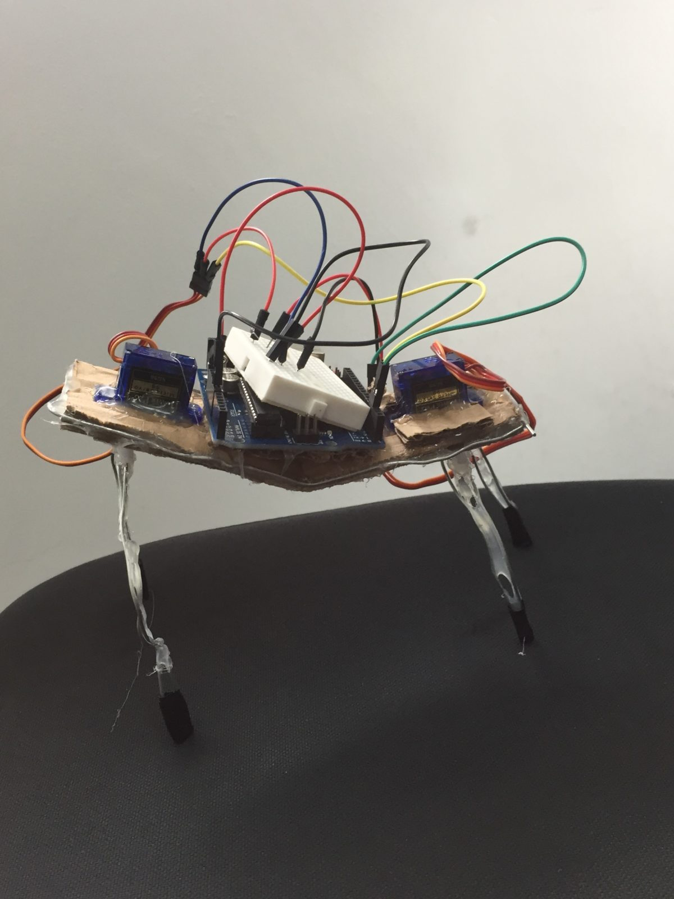

# WalkerBot
> Four-legged walking robot using Arduino and servo motors

An excellent intermidate project for Arduino hobbiest and students. 

## Installation

OS X Linux Windows:

Go to Arduino.cc/downloads to install the IDE

## Materials

<ul>
<li>Arduino Uno</li>
<li>USB cable</li>
<li>Micro servo x2</li>
<li>Bendable wire</li>
<li>Hot glue</li>
<li>Mini breadboard</li>
<li>Cardboard</li>
</ul>

## Connections

<ul>
<li>Arduino 5V to breadboard power</li>
<li>Arduino GND to breadboard GND</li>
<li>Servo 1 GND to breadboard GND</li>
<li>Servo 1 power to breadboard power</li>
<li>Servo 1 pin to Arduino pin 7</li>
<li>Servo 2 GND to breadboard GND</li>
<li>Servo 2 power to breadboard power</li>
<li>Servo 2 pin to Arduino pin 8</li>
</ul>

## Meta

Alice Walker – [@atatwalker](https://twitter.com/aliceemmwalker)

 This work is licensed under a <a rel="license" href="http://creativecommons.org/licenses/by-nc/4.0/">Creative Commons Attribution-NonCommercial 4.0 International License</a>.

[https://github.com/atatwalker/walkerbot](https://github.com/atatwalker)

[npm-image]: https://img.shields.io/npm/v/datadog-metrics.svg?style=flat-square
[npm-url]: https://npmjs.org/package/datadog-metrics
[npm-downloads]: https://img.shields.io/npm/dm/datadog-metrics.svg?style=flat-square

